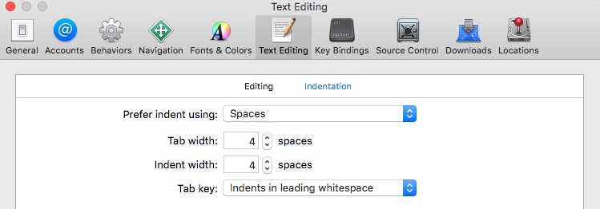

# Swift Style Guide.

本风格指南可能和其他的风格指南略有不同, 因为焦点集中在可读性和打印效果和网页显示效果. 虽然我们有很多作者共同完成这些书籍，但是我们以这篇风格指南为基础保持我们的书籍，教程，初学者工具的风格统一整洁。

<!--This style guide is different from others you may see, because the focus is centered on readability for print and the web. We created this style guide to keep the code in our books, tutorials, and starter kits nice and consistent — even though we have many different authors working on the books.-->

我们的总体目标是简洁，可读和简单。

<!--Our overarching goals are conciseness, readability, and simplicity.-->

如何使用Objectivce－C，那请参考[Objective-C Style Guide](https://github.com/raywenderlich/objective-c-style-guide)。

<!--Writing Objective-C? Check out our [Objective-C Style Guide](https://github.com/raywenderlich/objective-c-style-guide) too.-->

## 内容列表

* [命名](#命名)
  * [Prose](#prose)
  * [类名前缀](#类名前缀)
* [空格](#空格)
* [注释](#注释)
* [类和结构体](#类和结构体)
  * [Self的使用](#Self的使用)
  * [协议的遵从](#协议的遵从)
  * [计算属性](#计算属性)
* [函数的定义](#函数的定义)
* [闭包表达式](#闭包表达式)
* [类型](#类型)
  * [常量](#常量)
  * [可选类型](#可选类型)
  * [结构体的初始化](#结构体的初始化)
  * [类型推断](#类型推断)
  * [语法糖](#语法糖)
* [控制流](#控制流)
* [分号](#分号)
* [语言](#语言)
* [Copyright Statement](#copyright-statement)
* [Smiley Face](#smiley-face)
* [Credits](#credits)


## 命名

用描述性的名字和驼峰结构给类，方法，变量等命名。类名应该以大写字母开头，但是方法名和变量名应该以小写字母开头，不建议使用自制缩写例如：`but` short for `buton`, `pct` short for `percentage`

<!--Use descriptive names with camel case for classes, methods, variables, etc. Class names should be capitalized, while method names and variables should start with a lower case letter.-->

**推荐:**

```swift
private let maximumWidgetCount = 100

class WidgetContainer {
  var widgetButton: UIButton
  let widgetHeightPercentage = 0.85
}
```

**不推荐:**

```swift
let MAX_WIDGET_COUNT = 100

class app_widgetContainer {
  var wBut: UIButton
  let wHeightPct = 0.85
}
```

对于函数和init方法，建议给所有参数加上参数标签，除非函数意义非常明确，建议使用额外参数标签增加可读性

<!--For functions and init methods, prefer named parameters for all arguments unless the context is very clear. Include external parameter names if it makes function calls more readable.-->

```swift
func dateFromString(dateString: String) -> NSDate // 意义非常明确可以不加参数标签
func convertPointAt(column column: Int, row: Int) -> CGPoint
func timedAction(afterDelay delay: NSTimeInterval, perform action: SKAction) -> SKAction! // 额外参数标签增加可读性

// would be called like this:
dateFromString("2014-03-14")
convertPointAt(column: 42, row: 13)
timedAction(afterDelay: 1.0, perform: someOtherAction)
```

对于方法，下面的Apple开发这大会上提到的

<!--For methods, follow the standard Apple convention of referring to the first parameter in the method name:-->

```swift
class Counter {
  func combineWith(otherCounter: Counter, options: Dictionary?) { ... }
  func incrementBy(amount: Int) { ... }
}
```

### 枚举

枚举应该以大写字母开头驼峰命名

```swift
enum Shape {
  case Rectangle
  case Square
  case Triangle
  case Circle
}
```

### Prose

当在文字中引用带参数的函数时，需要包含参数名，并用`_`代替未命名参数

<!--When referring to functions in prose (tutorials, books, comments) include the required parameter names from the caller's perspective or `_` for unnamed parameters.
-->

> Call `convertPointAt(column:row:)` from your own `init` implementation.
>
> If you call `dateFromString(_:)` make sure that you provide a string with the format "yyyy-MM-dd".
>
> If you call `timedAction(afterDelay:perform:)` from `viewDidLoad()` remember to provide an adjusted delay value and an action to perform.
>
> You shouldn't call the data source method `tableView(_:cellForRowAtIndexPath:)` directly.

如果有疑惑，抬头看看Xcode的导航栏，用`ctrl`+`6`打开函数导航，我们的风格和Xcode一致

<!--When in doubt, look at how Xcode lists the method in the jump bar – our style here matches that.-->


### 类名前缀

Swift的类型根据模块生存自动命名空间，不需要自己添加类名前缀。如果两个不同模块的类重名了，你可以使用`模块名.类名`来调用

<!--Swift types are automatically namespaced by the module that contains them and you should not add a class prefix. If two names from different modules collide you can disambiguate by prefixing the type name with the module name.-->

```swift
import SomeModule

let myClass = MyModule.UsefulClass()
```


## 空格

* 缩进应该是用4个空格而不是tab，Xcode设置如下图

<!--* Indent using 4 spaces rather than tabs to conserve space and help prevent line wrapping. Be sure to set this preference in Xcode as shown below:-->

  

* 方法大括号和其他的大括号(`if`/`else`/`switch`/`while` 等等)总是在表达式的同一行打开，在新的一行结束

<!--* Method braces and other braces (`if`/`else`/`switch`/`while` etc.) always open on the same line as the statement but close on a new line.-->


<!--* Tip: You can re-indent by selecting some code (or ⌘A to select all) and then Control-I (or Editor\Structure\Re-Indent in the menu). Some of the Xcode template code will have 4-space tabs hard coded, so this is a good way to fix that.-->

**推荐:**
```swift
if user.isHappy {
  // Do something
} else {
  // Do something else
}
```

**不推荐:**
```swift
if user.isHappy
{
    // Do something
}
else {
    // Do something else
}
```

* 方法之间应该有一行空格，使代码清晰整洁，方法中的空格用以区分不同功能的代码块，过多的空格也提醒编程者代码是否需要重构

<!--* There should be exactly one blank line between methods to aid in visual clarity and organization. Whitespace within methods should separate functionality, but having too many sections in a method often means you should refactor into several methods.-->

## 注释

当必要时，用注视来解释**为什么**这一段代码做了什么，注释也需要实时更新和删除

<!--When they are needed, use comments to explain **why** a particular piece of code does something. Comments must be kept up-to-date or deleted.-->

避免成块的注释，因为代码应该是够自我解释的，*例外：这不适用于用来生成文档的注释*

<!--Avoid block comments inline with code, as the code should be as self-documenting as possible. *Exception: This does not apply to those comments used to generate documentation.*-->


## 类和结构体

### 应该用哪一个?

记住，结构体是[值类型](https://developer.apple.com/library/mac/documentation/Swift/Conceptual/Swift_Programming_Language/ClassesAndStructures.html#//apple_ref/doc/uid/TP40014097-CH13-XID_144)，用结构体来代表一个对象，那个对象必须没有id，例如数组[a, b, c]是和另一个数组[a, b, c]完全等价的，不论你用的是第一个还是第二个，它们都表示完全一样的东西，这就是为什么数组是结构体

<!--Remember, structs have [value semantics](https://developer.apple.com/library/mac/documentation/Swift/Conceptual/Swift_Programming_Language/ClassesAndStructures.html#//apple_ref/doc/uid/TP40014097-CH13-XID_144). Use structs for things that do not have an identity. An array that contains [a, b, c] is really the same as another array that contains [a, b, c] and they are completely interchangeable. It doesn't matter whether you use the first array or the second, because they represent the exact same thing. That's why arrays are structs.-->

类是[引用类型](https://developer.apple.com/library/mac/documentation/Swift/Conceptual/Swift_Programming_Language/ClassesAndStructures.html#//apple_ref/doc/uid/TP40014097-CH13-XID_145)，用类来代表一个对象，那个对象必须有id或者有特定的生命循环。例如人a和人b，他们如果有同样的名字，和同样的生日，不代表他们是同一个人，但是人的生日应该是结构体，因为1950年3月3日可以和另一个1950年3月3日完全相同。日期并没有id

<!--Classes have [reference semantics](https://developer.apple.com/library/mac/documentation/Swift/Conceptual/Swift_Programming_Language/ClassesAndStructures.html#//apple_ref/doc/uid/TP40014097-CH13-XID_145). Use classes for things that do have an identity or a specific life cycle. You would model a person as a class because two person objects are two different things. Just because two people have the same name and birthdate, doesn't mean they are the same person. But the person's birthdate would be a struct because a date of 3 March 1950 is the same as any other date object for 3 March 1950. The date itself doesn't have an identity.-->

有时候对象应该用结构体，但是需要遵从`AnyObject`协议或者已经被定义为类的(`NSDate`, `NSSet`)

<!--Sometimes, things should be structs but need to conform to `AnyObject` or are historically modeled as classes already (`NSDate`, `NSSet`). Try to follow these guidelines as closely as possible.-->

### 定义举例

这是一个良好风格的类定义的例子：

<!--Here's an example of a well-styled class definition:-->


```swift
class Circle: Shape {
  var x: Int, y: Int
  var radius: Double
  var diameter: Double {
    get {
      return radius * 2
    }
    set {
      radius = newValue / 2
    }
    didSet {
    	// property observers
    }
  }

  init(x: Int, y: Int, radius: Double) {
    self.x = x
    self.y = y
    self.radius = radius
  }

  convenience init(x: Int, y: Int, diameter: Double) {
    self.init(x: x, y: y, radius: diameter / 2)
  }

  func describe() -> String {
    return "I am a circle at \(centerString()) with an area of \(computeArea())"
  }

  override func computeArea() -> Double {
    return M_PI * radius * radius
  }

  private func centerString() -> String {
    return "(\(x),\(y))"
  }
}
```

这个例子很好的展示了以下的风格

<!--The example above demonstrates the following style guidelines:-->

+ 特定的属性，变量，常量，参数的定义以及其他的表达式需要在冒号之后有一个空格，例如`x: Int`， `Circle: Shape`

<!-- + Specify types for properties, variables, constants, argument declarations and other statements with a space after the colon but not before, e.g. `x: Int`, and `Circle: Shape`.-->

+ 定义多个变量和结构体在同一行他们需要逗号分隔，共享同一个上下文，例如 `var`

<!-- + Define multiple variables and structures on a single line if they share a common purpose / context.-->

+ getter和setter和property observers的定义需要缩进

 <!--+ Indent getter and setter definitions and property observers.-->

+ 不要添加`internal`因为它是默认修饰符。同样的override方法时不要重复修饰符
 
<!-- + Don't add modifiers such as `internal` when they're already the default. Similarly, don't repeat the access modifier when overriding a method.-->


### Self的使用

为了简洁，避免使用`self`因为Swift不需要`self`来访问属性或者执行方法

<!--For conciseness, avoid using `self` since Swift does not require it to access an object's properties or invoke its methods.-->

只有在需要用`self`来区分属性名和参数名时，和当在闭包里使用属性时才使用`self`：

<!--Use `self` when required to differentiate between property names and arguments in initializers, and when referencing properties in closure expressions (as required by the compiler):-->

```swift
class BoardLocation {
  let row: Int, column: Int

  init(row: Int, column: Int) {
    // 区分属性名和参数名
    self.row = row
    self.column = column
    
    let closure = {
      // 闭包
      println(self.row)
    }
  }
}
```

### 协议的遵从

当对一个类添加遵从协议的代码时，推荐添加一个类的extension来些协议的方法，保持这些方法成为一组代码块，可以简化添加协议的方法和相关方法到一个类里面

另外不要忘记使用 `// MARK: -` 来组织代码块

<!--When adding protocol conformance to a class, prefer adding a separate class extension for the protocol methods. This keeps the related methods grouped together with the protocol and can simplify instructions to add a protocol to a class with its associated methods.

Also, don't forget the `// MARK: -` comment to keep things well-organized!-->

**推荐:**
```swift
class MyViewcontroller: UIViewController {
  // class stuff here
}

// MARK: - UITableViewDataSource
extension MyViewcontroller: UITableViewDataSource {
  // table view data source methods
}

// MARK: - UIScrollViewDelegate
extension MyViewcontroller: UIScrollViewDelegate {
  // scroll view delegate methods
}
```

**不推荐:**
```swift
class MyViewcontroller: UIViewController, UITableViewDataSource, UIScrollViewDelegate {
  // all methods
}
```

### 计算属性

为了简洁，如果一个计算属性是只读的，就不需要get的括号，get的子句只在有set子句时才需要

<!--For conciseness, if a computed property is read-only, omit the get clause. The get clause is required only when a set clause is provided.-->

**推荐:**
```swift
var diameter: Double {
  return radius * 2
}
```

**不推荐:**
```swift
var diameter: Double {
  get {
    return radius * 2
  }
}
```

## 函数的定义

保持简短的函数定义在一行里包含前括号：

<!--Keep short function declarations on one line including the opening brace:-->

```swift
func reticulateSplines(spline: [Double]) -> Bool {
  // reticulate code goes here
}
```

对于较长的函数，在适当的位置换行，并在下一行添加一个缩进：

<!--For functions with long signatures, add line breaks at appropriate points and add an extra indent on subsequent lines:-->

```swift
func reticulateSplines(spline: [Double], adjustmentFactor: Double,
    translateConstant: Int, comment: String) -> Bool {
  // reticulate code goes here
}
```


## 闭包表达式

末尾闭包语法只适用于只有一个闭包在末尾，如果有多个闭包还是推荐使用参数标签

<!--Use trailing closure syntax only if there's a single closure expression parameter at the end of the argument list. Give the closure parameters descriptive names.-->

**推荐:**
```swift
UIView.animateWithDuration(1.0) {
  self.myView.alpha = 0
}

UIView.animateWithDuration(1.0,
  animations: {
    self.myView.alpha = 0
  },
  completion: { finished in
    self.myView.removeFromSuperview()
  }
)
```

**不推荐:**
```swift
UIView.animateWithDuration(1.0, animations: {
  self.myView.alpha = 0
})

UIView.animateWithDuration(1.0,
  animations: {
    self.myView.alpha = 0
  }) { f in
    self.myView.removeFromSuperview()
}
```

For single-expression closures where the context is clear, use implicit returns:

```swift
attendeeList.sort { a, b in
  a > b
}
```


## 类型

优先使用Swift原生的类型，必要时才使用Objective-C的类型

<!--Always use Swift's native types when available. Swift offers bridging to Objective-C so you can still use the full set of methods as needed.-->

**推荐:**
```swift
let width = 120.0                                    // Double
let widthString = (width as NSNumber).stringValue    // String
```

**不推荐:**
```swift
let width: NSNumber = 120.0                          // NSNumber
let widthString: NSString = width.stringValue        // NSString
```

在Sprite Kit里使用`CGFloat`可以使代码更简洁，减少转换

<!--In Sprite Kit code, use `CGFloat` if it makes the code more succinct by avoiding too many conversions.-->

### 常量

常量的定义应使用`let`关键字，变量使用`var`关键字。如果变量不需要改变，那就用`let`替换`var`

<!--Constants are defined using the `let` keyword, and variables with the `var` keyword. Always use `let` instead of `var` if the value of the variable will not change.-->

**小提示:** 定义所有变量时都用`let`关键字，当编译器报错时才把`let`改成`var`

<!--**Tip:** A good technique is to define everything using `let` and only change it to `var` if the compiler complains!-->


### 可选类型

声明变量和函数的返回值为可选类型用`?`，值就可以为nil

<!--Declare variables and function return types as optional with `?` where a nil value is acceptable.-->

只有当你稍后会初始化变量，才用强制解包`!`来声明变量，例如在`viewDidLoad`里面初始化的subviews。`@IBOutlet weak var someButton: UIButton!`StoryBoard里面直接连接IBOutlet自动生成的代码也是用`!`声明的

<!--Use implicitly unwrapped types declared with `!` only for instance variables that you know will be initialized later before use, such as subviews that will be set up in `viewDidLoad`.-->

当访问一个可选值，使用可选链如果该值只访问一次或者有链中的许多可选值

<!--When accessing an optional value, use optional chaining if the value is only accessed once or if there are many optionals in the chain:-->

```swift
self.textContainer?.textLabel?.setNeedsDisplay()
```

用可选绑定可以更方便的一次解开多个operations

<!--Use optional binding when it's more convenient to unwrap once and perform multiple operations:-->

```swift
if let textContainer = self.textContainer {
  // do many things with textContainer
}
```

当命名可以选变量或者属性时，避免使用`optionalString` 或者 `maybeView`，应为他们的类型已经表明他们是可以选的了

<!--When naming optional variables and properties, avoid naming them like `optionalString` or `maybeView` since their optional-ness is already in the type declaration.-->

可选绑定，不推荐`unwrappedView` 或者 `actualLabel`此类的命名，推荐和原变量一样的名字

<!--For optional binding, shadow the original name when appropriate rather than using names like `unwrappedView` or `actualLabel`.-->

**推荐:**
```swift
var subview: UIView?
var volume: Double?

// later on...
if let subview = subview, volume = volume {
  // do something with unwrapped subview and volume
}
```

**不推荐:**
```swift
var optionalSubview: UIView?
var volume: Double?

if let unwrappedSubview = optionalSubview {
  if let realVolume = volume {
    // do something with unwrappedSubview and realVolume
  }
}
```

### 结构体的初始化

用Swift原生的初始化方法而不是用传统CGGeometry中的构造函数

<!--Use the native Swift struct initializers rather than the legacy CGGeometry constructors.-->

**推荐:**
```swift
let bounds = CGRect(x: 40, y: 20, width: 120, height: 80)
let centerPoint = CGPoint(x: 96, y: 42)
```

**不推荐:**
```swift
let bounds = CGRectMake(40, 20, 120, 80)
let centerPoint = CGPointMake(96, 42)
```

结构体常量推荐使用struct-scope例如`CGRect.infinite`, `CGRect.null`。不推荐用全局常量`CGRectInfinite`, `CGRectNull`。对于变量赋值，你可以用更短的`.zero`

<!--Prefer the struct-scope constants `CGRect.infinite`, `CGRect.null`, etc. over global constants `CGRectInfinite`, `CGRectNull`, etc. For existing variables, you can use the shorter `.zero`.-->

### 类型推断

推荐更短的代码，并让编译器自己推断变量类型，除非你需要制定一个变量的默认类型，例如`CGFloat` 或者 `Int16`

<!--Prefer compact code and let the compiler infer the type for a constant or variable, unless you need a specific type other than the default such as `CGFloat` or `Int16`.
-->

**推荐:**
```swift
let message = "Click the button"
let currentBounds = computeViewBounds()
var names = [String]()
let maximumWidth: CGFloat = 106.5
```

**不推荐:**
```swift
let message: String = "Click the button"
let currentBounds: CGRect = computeViewBounds()
var names: [String] = []
```

**注意**：根据这一指导方针意味着选择描述性的名字，甚至比以前更重要。

<!--**NOTE**: Following this guideline means picking descriptive names is even more important than before.-->


### 语法糖

推荐更短的写法，而不是通用语法

<!--Prefer the shortcut versions of type declarations over the full generics syntax.-->

**推荐:**
```swift
var deviceModels: [String]
var employees: [Int: String]
var faxNumber: Int?
```

**不推荐:**
```swift
var deviceModels: Array<String>
var employees: Dictionary<Int, String>
var faxNumber: Optional<Int>
```


## 控制流

推荐使用`for-in`而不是使用`for-condition-increment`

<!--Prefer the `for-in` style of `for` loop over the `for-condition-increment` style.-->

**推荐:**
```swift
for _ in 0..<3 {
  println("Hello three times")
}

for (index, person) in attendeeList.enumerate() {
  println("\(person) is at position #\(index)")
}
```

**不推荐:**
```swift
for var i = 0; i < 3; i++ {
  println("Hello three times")
}

for var i = 0; i < attendeeList.count; i++ {
  let person = attendeeList[i]
  println("\(person) is at position #\(i)")
}
```


## 分号

Swift不需要在每行后面加分号。只有当你需要在一行中写多行代码时才需要加分号

<!--Swift does not require a semicolon after each statement in your code. They are only required if you wish to combine multiple statements on a single line.-->

但是不要在一行中写多行代码

<!--Do not write multiple statements on a single line separated with semicolons.-->

只有一个例外就是`for-conditional-increment`结构需要分号，但是请尽量使用`for-in`结构

<!--The only exception to this rule is the `for-conditional-increment` construct, which requires semicolons. However, alternative `for-in` constructs should be used where possible.-->

**推荐:**
```swift
let swift = "not a scripting language"
```

**不推荐:**
```swift
let swift = "not a scripting language";
```

**注意**: Swift和JavaScript很不相同，[js中漏掉分号是不安全的](http://stackoverflow.com/questions/444080/do-you-recommend-using-semicolons-after-every-statement-in-javascript)

<!--**NOTE**: Swift is very different to JavaScript, where omitting semicolons is [generally considered unsafe](http://stackoverflow.com/questions/444080/do-you-recommend-using-semicolons-after-every-statement-in-javascript)-->

## 语言

使用美式英语拼写

<!--Use US English spelling to match Apple's API.-->

**推荐:**
```swift
let color = "red"
```

**不推荐:**
```swift
let colour = "red"
```

## Copyright Statement

The following copyright statement should be included at the top of every source
file:

    /**
     Copyright (c) 2016 Razeware LLC
     
     Permission is hereby granted, free of charge, to any person obtaining a copy
     of this software and associated documentation files (the "Software"), to deal
     in the Software without restriction, including without limitation the rights
     to use, copy, modify, merge, publish, distribute, sublicense, and/or sell
     copies of the Software, and to permit persons to whom the Software is
     furnished to do so, subject to the following conditions:
     
     The above copyright notice and this permission notice shall be included in
     all copies or substantial portions of the Software.
     
     THE SOFTWARE IS PROVIDED "AS IS", WITHOUT WARRANTY OF ANY KIND, EXPRESS OR
     IMPLIED, INCLUDING BUT NOT LIMITED TO THE WARRANTIES OF MERCHANTABILITY,
     FITNESS FOR A PARTICULAR PURPOSE AND NONINFRINGEMENT. IN NO EVENT SHALL THE
     AUTHORS OR COPYRIGHT HOLDERS BE LIABLE FOR ANY CLAIM, DAMAGES OR OTHER
     LIABILITY, WHETHER IN AN ACTION OF CONTRACT, TORT OR OTHERWISE, ARISING FROM,
     OUT OF OR IN CONNECTION WITH THE SOFTWARE OR THE USE OR OTHER DEALINGS IN
     THE SOFTWARE.
     */

## Smiley Face

Smiley faces are a very prominent style feature of the raywenderlich.com site! It is very important to have the correct smile signifying the immense amount of happiness and excitement for the coding topic. The closing square bracket `]` is used because it represents the largest smile able to be captured using ASCII art. A closing parenthesis `)` creates a half-hearted smile, and thus is not preferred.

**推荐:**
```
:]
```

**不推荐:**
```
:)
```  


## Credits

This style guide is a collaborative effort from the most stylish raywenderlich.com team members: 

* [Jawwad Ahmad](https://github.com/jawwad)
* [Soheil Moayedi Azarpour](https://github.com/moayes)
* [Scott Berrevoets](https://github.com/Scott90)
* [Eric Cerney](https://github.com/ecerney)
* [Sam Davies](https://github.com/sammyd)
* [Evan Dekhayser](https://github.com/edekhayser)
* [Jean-Pierre Distler](https://github.com/pdistler)
* [Colin Eberhardt](https://github.com/ColinEberhardt)
* [Greg Heo](https://github.com/gregheo)
* [Matthijs Hollemans](https://github.com/hollance)
* [Erik Kerber](https://github.com/eskerber)
* [Christopher LaPollo](https://github.com/elephantronic)
* [Ben Morrow](https://github.com/benmorrow)
* [Andy Pereira](https://github.com/macandyp)
* [Ryan Nystrom](https://github.com/rnystrom)
* [Andy Obusek](https://github.com/obuseme)
* [Cesare Rocchi](https://github.com/funkyboy)
* [Ellen Shapiro](https://github.com/designatednerd)
* [Marin Todorov](https://github.com/icanzilb)
* [Chris Wagner](https://github.com/cwagdev)
* [Ray Wenderlich](https://github.com/rwenderlich)
* [Jack Wu](https://github.com/jackwu95)

Hat tip to [Nicholas Waynik](https://github.com/ndubbs) and the [Objective-C Style Guide](https://github.com/raywenderlich/objective-c-style-guide) team!

We also drew inspiration from Apple’s reference material on Swift:

* [The Swift Programming Language](https://developer.apple.com/library/prerelease/ios/documentation/swift/conceptual/swift_programming_language/index.html)
* [Using Swift with Cocoa and Objective-C](https://developer.apple.com/library/prerelease/ios/documentation/Swift/Conceptual/BuildingCocoaApps/index.html)
* [Swift Standard Library Reference](https://developer.apple.com/library/prerelease/ios/documentation/General/Reference/SwiftStandardLibraryReference/index.html)
